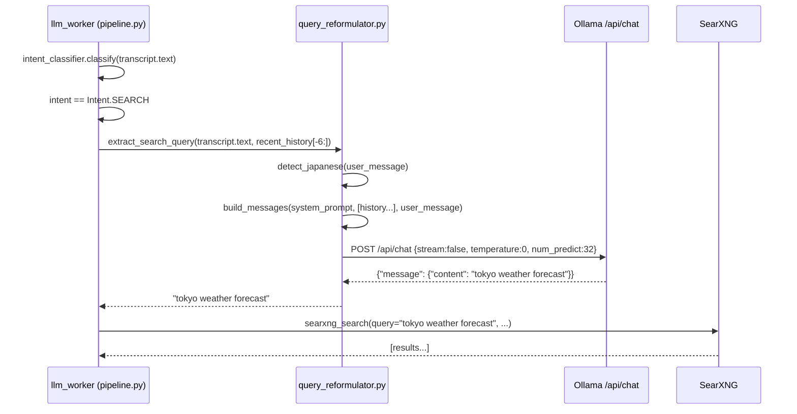

# Design Document: Search Query Reformulator

## Overview

The search query reformulator is a thin, isolated preprocessing module inserted between
the intent classifier and the SearXNG call in `llm_worker`. When the pipeline classifies
a user utterance as `Intent.SEARCH`, the reformulator makes a single, non-streaming
Ollama call to convert the raw conversational transcript into a concise 3–6 word English
search query before that query is forwarded to SearXNG.

The module solves two concrete problems:

1. **Conversational noise** — raw transcripts contain filler words, politeness markers,
   and full sentences that cause SearXNG to match on noise rather than the user's actual
   information need.
2. **Japanese-to-English translation** — most web content is English-indexed; Japanese
   queries hit far fewer pages. The reformulator detects Japanese input via Unicode ranges
   and instructs the model to produce an English translation of the query intent.

The reformulator is completely isolated: it receives only the latest user message (and an
optional slice of recent conversation history for anaphora resolution), returns only a
plain string, and has no side effects on conversation history, the main LLM call, the
streaming pipeline, or the TTS/STT pipelines.

---

## Architecture



The reformulator sits entirely within the `Intent.SEARCH` branch of `llm_worker`. It is
called synchronously (blocking the async event loop for at most 10 seconds) before the
existing `searxng_search` call. The rest of the pipeline — RAG, prompt building, LLM
streaming, TTS — is completely unaffected.

### Module placement

```
server/
  search/
    __init__.py
    searxng_client.py          (existing)
    query_reformulator.py      (NEW)
  pipeline.py                  (modified: Intent.SEARCH branch only)
```

---

## Components and Interfaces

### `query_reformulator.py` — public API

```python
OLLAMA_BASE_URL: str = "http://localhost:11434"
REFORMULATOR_MODEL: str = "qwen2.5:3b"

def extract_search_query(
    user_message: str,
    recent_history: list[dict] | None = None,
) -> str:
    """
    Convert a raw conversational utterance into a concise English search query.

    Args:
        user_message:   The verbatim transcript string (transcript.text).
        recent_history: Optional slice of conversation_history. The function
                        internally enforces a hard [-6:] slice regardless of
                        the length supplied by the caller.

    Returns:
        A concise English search query string (stripped of whitespace).
        Falls back to user_message on any exception.
    """
```

**Constraints enforced inside the function:**

| Constraint | Implementation |
|---|---|
| Hard history limit | `history_slice = (recent_history or [])[-6:]` |
| Japanese detection | `any(('\u3040' <= c <= '\u30ff') or ('\u4e00' <= c <= '\u9faf') for c in user_message)` |
| HTTP timeout | `httpx.Timeout(10.0)` |
| Non-streaming | `"stream": False` in request body |
| Deterministic output | `"temperature": 0, "num_predict": 32` |
| Whitespace strip | `response_content.strip()` before return |
| Fallback | `except Exception: logger.warning(...); return user_message` |

### `pipeline.py` — integration point (Intent.SEARCH branch only)

The only change to `pipeline.py` is replacing the bare `transcript.text` argument to
`searxng_search` with a call to `extract_search_query`. No other code in the file is
touched.

**Before:**
```python
elif intent == Intent.SEARCH:
    try:
        from server.search.searxng_client import searxng_search
        results = await searxng_search(
            query=transcript.text,
            ...
        )
```

**After:**
```python
elif intent == Intent.SEARCH:
    try:
        from server.search.searxng_client import searxng_search
        from server.search.query_reformulator import extract_search_query
        search_query = extract_search_query(
            transcript.text,
            recent_history=self.state.conversation_history,
        )
        logger.info(f"Reformulated query: '{search_query}' (original: '{transcript.text[:50]}')")
        results = await searxng_search(
            query=search_query,
            ...
        )
```

The `extract_search_query` call is already inside the existing `try/except Exception`
block that wraps the entire `Intent.SEARCH` branch, so any reformulator failure
automatically falls through to the `intent = Intent.GENERAL` fallback. The reformulator
also has its own internal `try/except` that returns `user_message` on failure, providing
a double safety net.

---

## Data Models

### Ollama `/api/chat` request payload

```python
{
    "model": "qwen2.5:3b",          # REFORMULATOR_MODEL constant
    "stream": False,
    "options": {
        "temperature": 0,
        "num_predict": 32,
    },
    "messages": [
        {"role": "system", "content": "<system_prompt>"},
        # --- optional: up to 6 history messages ---
        {"role": "user",      "content": "<prior user turn>"},
        {"role": "assistant", "content": "<prior assistant turn>"},
        # ... (at most 6 total history messages)
        # --- always last ---
        {"role": "user", "content": "<current user_message>"},
    ],
}
```

### System prompt variants

**English input** (no Japanese characters detected):
```
You are a search query extractor. Your only job is to convert the user's
conversational message into a concise English web search query of 3 to 6 words.
Output only the search query. No explanation. No punctuation at the end. No quotes.
One line only.
```

**Japanese input** (one or more characters in U+3040–U+30FF or U+4E00–U+9FAF):
```
You are a search query extractor. Your only job is to translate the user's
Japanese message into a concise English web search query of 3 to 6 words.
Output only the English search query. No explanation. No punctuation at the end.
No quotes. One line only.
```

The system prompt is identical in structure; only the second sentence differs to add the
explicit translation instruction for Japanese input. The system prompt is **never**
modified by the presence or absence of `recent_history`.

### Ollama `/api/chat` response (relevant fields)

```python
{
    "message": {
        "role": "assistant",
        "content": "tokyo weather forecast"   # stripped before return
    }
}
```

### `recent_history` element schema

Each element is a dict from `PipelineState.conversation_history`:
```python
{"role": "user" | "assistant", "content": str, "lang": "en" | "ja"}
```

The `lang` field is present in all history entries written by the current pipeline but is
not required by the reformulator — it is passed through to Ollama as-is and ignored
otherwise.

---

## Correctness Properties

*A property is a characteristic or behavior that should hold true across all valid
executions of a system — essentially, a formal statement about what the system should do.
Properties serve as the bridge between human-readable specifications and machine-verifiable
correctness guarantees.*

### Property 1: Non-empty output invariant

*For any* non-empty `user_message` string, `extract_search_query` SHALL return a
non-empty string — whether the Ollama call succeeds (returns a stripped response) or
fails (returns `user_message` as fallback).

**Validates: Requirements 6.2, 3.1**

---

### Property 2: Fallback preserves original input

*For any* `user_message` string and *any* exception raised by the httpx client,
`extract_search_query` SHALL return exactly `user_message` (the unmodified input string).

**Validates: Requirements 3.1, 3.2**

---

### Property 3: Whitespace is always stripped

*For any* string returned by the mocked Ollama endpoint (including strings with arbitrary
leading and trailing whitespace, tabs, and newlines), the value returned by
`extract_search_query` SHALL equal `ollama_response.strip()`.

**Validates: Requirements 1.5**

---

### Property 4: Japanese detection drives system prompt selection

*For any* `user_message` string containing at least one character in the Unicode ranges
U+3040–U+30FF (hiragana/katakana) or U+4E00–U+9FAF (CJK ideographs), the system prompt
in the Ollama request SHALL contain a translation instruction (e.g. "translate"). *For
any* `user_message` containing no such characters, the system prompt SHALL NOT contain
that translation instruction.

**Validates: Requirements 2.1, 2.3**

---

### Property 5: History slice hard limit

*For any* `recent_history` list of arbitrary length ≥ 0, the number of history messages
prepended in the Ollama request `messages` array SHALL be at most 6, regardless of the
length of the list supplied by the caller.

**Validates: Requirements 7.2**

---

### Property 6: History ordering — current message is always last

*For any* non-empty `recent_history`, the final element of the `messages` array in the
Ollama request SHALL be `{"role": "user", "content": user_message}` (the current user
message), and all history entries SHALL appear before it.

**Validates: Requirements 7.3**

---

### Property 7: recent_history is not mutated

*For any* `recent_history` list passed to `extract_search_query`, the list SHALL have the
same length and identical contents after the function returns as it did before the call.

**Validates: Requirements 7.4**

---

### Property 8: System prompt is invariant to recent_history presence

*For any* `user_message`, the system prompt string in the Ollama request SHALL be
identical whether `recent_history` is `None`, an empty list, or a non-empty list.

**Validates: Requirements 7.5**

---

### Property 9: None and empty list are equivalent

*For any* `user_message`, calling `extract_search_query(user_message, recent_history=None)`
and `extract_search_query(user_message, recent_history=[])` SHALL produce Ollama request
`messages` arrays with identical structure (same number of messages, same roles, same
system prompt content).

**Validates: Requirements 7.6**

---

## Error Handling

### Reformulator-level fallback (inside `query_reformulator.py`)

```
extract_search_query(user_message, recent_history)
  │
  ├─ try:
  │    build messages array
  │    httpx.post(OLLAMA_BASE_URL/api/chat, timeout=10.0)
  │    parse response["message"]["content"].strip()
  │    return reformulated_query
  │
  └─ except Exception as e:
       logger.warning(f"Query reformulation failed: {e}; falling back to raw input")
       return user_message          ← always a non-empty string
```

Exceptions caught include (but are not limited to):
- `httpx.ConnectError` — Ollama not running
- `httpx.TimeoutException` — call exceeded 10 seconds
- `httpx.HTTPStatusError` — non-2xx response
- `KeyError` / `json.JSONDecodeError` — malformed response body
- Any other `Exception`

### Pipeline-level fallback (inside `pipeline.py`)

The `Intent.SEARCH` branch is already wrapped in `try/except Exception` that falls back
to `intent = Intent.GENERAL`. The reformulator's internal fallback fires first (returning
`user_message`), so `searxng_search` still runs with the raw transcript. Only if
`searxng_search` itself fails does the pipeline fall back to `Intent.GENERAL`.

### Logging

| Event | Level | Message |
|---|---|---|
| Reformulation succeeded | INFO | `Reformulated query: '...' (original: '...')` |
| Reformulation failed | WARNING | `Query reformulation failed: <exc>; falling back to raw input` |
| Search returned results | INFO | `Search returned N results for query: '...'` (existing) |

---

## Testing Strategy

### Unit tests (`server/search/test_query_reformulator.py`)

Unit tests use `unittest.mock.patch` to replace `httpx.Client.post` with a mock that
returns a controlled response. They verify specific examples and edge cases:

- Successful English reformulation returns stripped content
- Successful Japanese reformulation returns stripped content
- `ConnectError` triggers fallback to `user_message`
- `TimeoutException` triggers fallback to `user_message`
- Non-2xx HTTP status triggers fallback
- Malformed JSON response triggers fallback
- `recent_history=None` and `recent_history=[]` produce identical request structures
- `OLLAMA_BASE_URL` defaults to `"http://localhost:11434"`
- `REFORMULATOR_MODEL` defaults to `"qwen2.5:3b"`
- Request body contains `stream=False`, `temperature=0`, `num_predict=32`
- WARNING is logged on any exception

### Property-based tests (`server/search/test_query_reformulator_properties.py`)

Property tests use [Hypothesis](https://hypothesis.readthedocs.io/) (already compatible
with the project's Python version; add `hypothesis` to `requirements.txt`). Each test
runs a minimum of 100 iterations.

**Property 1 — Non-empty output invariant**
```python
# Feature: search-query-reformulator, Property 1: non-empty output invariant
@given(st.text(min_size=1))
def test_non_empty_output(user_message):
    # Mock httpx to return a valid response
    with mock_ollama_success("some query"):
        result = extract_search_query(user_message)
    assert len(result.strip()) > 0
```

**Property 2 — Fallback preserves original input**
```python
# Feature: search-query-reformulator, Property 2: fallback preserves original input
@given(st.text(min_size=1), st.sampled_from([ConnectError, TimeoutException, ...]))
def test_fallback_returns_original(user_message, exc_class):
    with mock_ollama_raises(exc_class):
        result = extract_search_query(user_message)
    assert result == user_message
```

**Property 3 — Whitespace is always stripped**
```python
# Feature: search-query-reformulator, Property 3: whitespace always stripped
@given(st.text(), st.text(alphabet=" \t\n\r"))
def test_whitespace_stripped(core_content, padding):
    raw_response = padding + core_content + padding
    with mock_ollama_success(raw_response):
        result = extract_search_query("any query")
    assert result == raw_response.strip()
```

**Property 4 — Japanese detection drives system prompt selection**
```python
# Feature: search-query-reformulator, Property 4: japanese detection drives prompt
@given(st.text(alphabet=st.characters(min_codepoint=0x3040, max_codepoint=0x30FF), min_size=1))
def test_japanese_input_uses_translation_prompt(japanese_text):
    captured = capture_ollama_request(japanese_text)
    system_msg = captured["messages"][0]["content"]
    assert "translate" in system_msg.lower()

@given(st.text(alphabet=st.characters(max_codepoint=0x302F), min_size=1))
def test_non_japanese_input_no_translation_prompt(ascii_text):
    captured = capture_ollama_request(ascii_text)
    system_msg = captured["messages"][0]["content"]
    assert "translate" not in system_msg.lower()
```

**Property 5 — History slice hard limit**
```python
# Feature: search-query-reformulator, Property 5: history slice hard limit
@given(st.lists(st.fixed_dictionaries({"role": st.sampled_from(["user","assistant"]), "content": st.text()}), min_size=7, max_size=50))
def test_history_slice_limit(long_history):
    captured = capture_ollama_request("query", recent_history=long_history)
    # messages = [system] + [history...] + [user]
    history_messages = captured["messages"][1:-1]
    assert len(history_messages) <= 6
```

**Property 6 — Current message is always last**
```python
# Feature: search-query-reformulator, Property 6: current message is always last
@given(st.text(min_size=1), st.lists(st.fixed_dictionaries(...), min_size=1))
def test_current_message_is_last(user_message, history):
    captured = capture_ollama_request(user_message, recent_history=history)
    last_msg = captured["messages"][-1]
    assert last_msg["role"] == "user"
    assert last_msg["content"] == user_message
```

**Property 7 — recent_history is not mutated**
```python
# Feature: search-query-reformulator, Property 7: recent_history not mutated
@given(st.lists(st.fixed_dictionaries({"role": st.sampled_from(["user","assistant"]), "content": st.text()})))
def test_history_not_mutated(history):
    original = copy.deepcopy(history)
    with mock_ollama_success("result"):
        extract_search_query("query", recent_history=history)
    assert history == original
```

**Property 8 — System prompt invariant to recent_history**
```python
# Feature: search-query-reformulator, Property 8: system prompt invariant to history
@given(st.text(min_size=1), st.lists(st.fixed_dictionaries(...)))
def test_system_prompt_invariant(user_message, history):
    captured_none = capture_ollama_request(user_message, recent_history=None)
    captured_hist = capture_ollama_request(user_message, recent_history=history)
    assert captured_none["messages"][0]["content"] == captured_hist["messages"][0]["content"]
```

**Property 9 — None and empty list are equivalent**
```python
# Feature: search-query-reformulator, Property 9: None and [] are equivalent
@given(st.text(min_size=1))
def test_none_and_empty_list_equivalent(user_message):
    captured_none  = capture_ollama_request(user_message, recent_history=None)
    captured_empty = capture_ollama_request(user_message, recent_history=[])
    assert captured_none["messages"] == captured_empty["messages"]
```

### Integration test (manual / CI)

A single integration test that requires a live Ollama instance verifies end-to-end
behavior:
- English input → non-empty English string returned
- Japanese input → non-empty English string returned
- Ollama unreachable → raw input returned within 11 seconds

### What is NOT tested with PBT

- The word count of the returned query (3–6 words) — this is a prompt engineering
  constraint on LLM output, not a deterministic code invariant.
- The semantic quality of the reformulation — not computable.
- Pipeline isolation (no WebSocket send, no history mutation in `pipeline.py`) — verified
  by code review and the existing pipeline unit tests.
