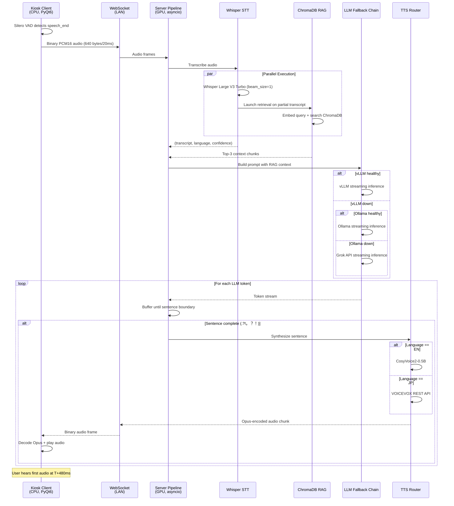

# Design Document: Real-Time Streaming Voice Chatbot for Kiosk/Robot Deployment

## Overview

A fully self-hosted, bilingual (English + Japanese) real-time streaming voice chatbot system designed for kiosk and robot deployment. The system achieves sub-600ms Time-to-First-Audio (TTFA) through aggressive pipeline parallelization, sentence-boundary TTS streaming, and a three-tier LLM fallback chain (vLLM → Ollama → Grok API). The architecture follows a strict separation: the Python kiosk client handles all I/O (audio capture, VAD, playback, UI), while the GPU inference server executes all AI processing (STT, LLM, TTS, RAG).

## Main Algorithm/Workflow



## Core Interfaces/Types

### WebSocket Protocol Messages

```python
from typing import Literal, TypedDict, Optional
from enum import Enum

# Client → Server (Upstream)
class SessionStartMessage(TypedDict):
    type: Literal["session_start"]
    kiosk_id: str
    kiosk_location: str

class TextInputMessage(TypedDict):
    type: Literal["text_input"]
    text: str
    lang: Literal["auto", "en", "ja"]

class InterruptMessage(TypedDict):
    type: Literal["interrupt"]

UpstreamMessage = SessionStartMessage | TextInputMessage | InterruptMessage

# Server → Client (Downstream)
class TranscriptEvent(TypedDict):
    type: Literal["transcript"]
    text: str
    lang: Literal["en", "ja"]
    final: bool

class LLMTextChunk(TypedDict):
    type: Literal["llm_text_chunk"]
    text: str
    final: bool

class StatusEvent(TypedDict):
    type: Literal["status"]
    state: Literal["listening", "thinking", "speaking", "idle"]

class TTSStartEvent(TypedDict):
    type: Literal["tts_start"]
    lang: Literal["en", "ja"]

class TTSEndEvent(TypedDict):
    type: Literal["tts_end"]

class ErrorEvent(TypedDict):
    type: Literal["error"]
    code: str
    message: str

DownstreamMessage = (
    TranscriptEvent | LLMTextChunk | StatusEvent | 
    TTSStartEvent | TTSEndEvent | ErrorEvent
)
```

### Audio Data Types

```python
import numpy as np
from dataclasses import dataclass

@dataclass
class AudioFrame:
    """20ms PCM16 audio frame"""
    data: bytes  # 640 bytes = 16kHz * 1ch * 2 bytes * 0.02s
    timestamp_ms: int
    sample_rate: int = 16000
    channels: int = 1
    
    def to_numpy(self) -> np.ndarray:
        return np.frombuffer(self.data, dtype=np.int16)

@dataclass
class VADEvent:
    """Voice Activity Detection event"""
    event_type: Literal["speech_start", "speech_chunk", "speech_end"]
    audio_buffer: Optional[bytes] = None  # Accumulated audio on speech_end
    timestamp_ms: int = 0
```

### STT Types

```python
from dataclasses import dataclass

@dataclass
class TranscriptionResult:
    text: str
    language: Literal["en", "ja"]
    confidence: float
    duration_ms: int
```

### LLM Types

```python
from typing import AsyncIterator, Protocol

class BaseLLMBackend(Protocol):
    """Interface contract for all LLM backends"""
    
    async def ping(self) -> None:
        """Health check. Raise on failure."""
        ...
    
    async def stream(
        self, 
        messages: list[dict], 
        tools: Optional[list[dict]] = None
    ) -> AsyncIterator[str]:
        """Stream text tokens. Raise on fatal error."""
        ...

@dataclass
class LLMMessage:
    role: Literal["system", "user", "assistant"]
    content: str
```

### TTS Types

```python
from typing import AsyncIterator, Protocol

class BaseTTSEngine(Protocol):
    """Interface contract for all TTS engines"""
    
    async def synthesize_stream(self, text: str) -> AsyncIterator[bytes]:
        """Stream audio chunks (Opus-encoded)."""
        ...
    
    async def health_check(self) -> bool:
        """Return True if engine is operational."""
        ...
```

### RAG Types

```python
from dataclasses import dataclass

@dataclass
class DocumentChunk:
    id: str
    text: str
    lang: Literal["en", "ja"]
    floor: Optional[int]
    type: Literal["floor", "facility", "room", "emergency"]

@dataclass
class RetrievalResult:
    chunks: list[str]
    query: str
    lang: Literal["en", "ja"]
    retrieval_time_ms: int
```

## Key Functions with Formal Specifications

### Function 1: LLM Fallback Chain Stream

```python
async def stream_with_fallback(
    self,
    messages: list[dict],
    tools: Optional[list[dict]] = None
) -> AsyncIterator[str]:
    """
    Stream LLM tokens with automatic backend fallback.
    
    Preconditions:
    - messages is non-empty list of valid message dicts
    - Each message has 'role' and 'content' keys
    - At least one backend is configured
    
    Postconditions:
    - Yields at least one token if any backend succeeds
    - Raises RuntimeError if all backends fail
    - Updates self._healthy_index to last successful backend
    - No side effects on input messages
    
    Loop Invariants:
    - All previously tried backends have failed
    - Current backend index is within valid range
    - Health check state remains consistent
    """
    for i, backend in enumerate(
        self.backends[self._healthy_index:], 
        self._healthy_index
    ):
        if not await self.health_check(backend):
            continue
        
        try:
            token_count = 0
            async for token in backend.stream(messages, tools=tools):
                token_count += 1
                yield token
            
            # Postcondition: At least one token yielded
            assert token_count > 0, "Backend succeeded but yielded no tokens"
            
            self._healthy_index = i  # Update cache
            return
            
        except Exception as e:
            # Log failure, continue to next backend
            logger.warning(f"Backend {backend.__class__.__name__} failed: {e}")
            continue
    
    # All backends exhausted
    raise RuntimeError("All LLM backends failed")
```

### Function 2: Sentence-Boundary TTS Streaming

```python
async def stream_tts_with_sentence_boundaries(
    token_stream: AsyncIterator[str],
    lang: Literal["en", "ja"],
    ws_sender: WebSocketSender
) -> None:
    """
    Stream TTS audio by synthesizing complete sentences as they arrive.
    
    Preconditions:
    - token_stream is a valid async iterator
    - lang is either "en" or "ja"
    - ws_sender is connected and ready
    
    Postconditions:
    - All tokens from token_stream are processed
    - All complete sentences are synthesized and sent
    - Remaining buffer content is flushed
    - No tokens are lost or duplicated
    
    Loop Invariants:
    - buffer contains only incomplete sentence fragments
    - All previously complete sentences have been synthesized
    - Token order is preserved
    """
    SENTENCE_ENDINGS = frozenset('.?!。？！…')
    MIN_SENTENCE_LENGTH = 8
    
    buffer = ""
    tts = get_tts_engine(lang)
    
    async for token in token_stream:
        buffer += token
        
        # Check for sentence boundary
        if (buffer and 
            buffer[-1] in SENTENCE_ENDINGS and 
            len(buffer) >= MIN_SENTENCE_LENGTH):
            
            # Synthesize complete sentence
            async for audio_chunk in tts.synthesize_stream(buffer):
                await ws_sender.send_bytes(audio_chunk)
            
            buffer = ""  # Reset for next sentence
    
    # Flush remaining buffer
    if buffer.strip():
        async for audio_chunk in tts.synthesize_stream(buffer):
            await ws_sender.send_bytes(audio_chunk)
```

### Function 3: Parallel RAG Retrieval

```python
async def retrieve_with_stt_parallel(
    audio_bytes: bytes,
    stt_model: WhisperModel,
    rag_store: BuildingKB
) -> tuple[TranscriptionResult, RetrievalResult]:
    """
    Execute STT and RAG retrieval in parallel for minimum latency.
    
    Preconditions:
    - audio_bytes is non-empty PCM16 audio data
    - stt_model is loaded and ready
    - rag_store is initialized with documents
    
    Postconditions:
    - Returns valid transcription result
    - Returns valid retrieval result
    - Both operations complete before return
    - Retrieval uses detected language from STT
    
    Loop Invariants: N/A (no loops, parallel execution)
    """
    import asyncio
    
    # Start STT transcription
    transcription_task = asyncio.create_task(
        stt_model.transcribe_async(audio_bytes)
    )
    
    # Wait for partial result to launch RAG
    # (In practice, use streaming STT with provisional results)
    transcription = await transcription_task
    
    # Launch RAG retrieval immediately
    retrieval_task = asyncio.create_task(
        rag_store.retrieve(
            query=transcription.text,
            lang=transcription.language,
            n=3
        )
    )
    
    # Wait for RAG to complete
    retrieval = await retrieval_task
    
    return transcription, retrieval
```

### Function 4: Barge-in Interrupt Handler

```python
async def handle_interrupt(
    pipeline_state: PipelineState,
    interrupt_event: asyncio.Event
) -> None:
    """
    Handle user interrupt (barge-in) during TTS playback.
    
    Preconditions:
    - pipeline_state is valid and accessible
    - interrupt_event is an asyncio.Event instance
    
    Postconditions:
    - All pipeline queues are drained
    - Pipeline state is reset to "listening"
    - interrupt_event is set
    - Client receives status update
    
    Loop Invariants:
    - All queue items processed so far are discarded
    - Pipeline workers check interrupt_event on each iteration
    """
    # Signal all workers to abort
    interrupt_event.set()
    
    # Drain all queues
    await drain_queue(pipeline_state.transcript_queue)
    await drain_queue(pipeline_state.token_queue)
    await drain_queue(pipeline_state.audio_queue)
    
    # Reset state
    pipeline_state.current_turn = None
    pipeline_state.status = "listening"
    
    # Notify client
    await pipeline_state.ws_sender.send_json({
        "type": "status",
        "state": "listening"
    })
    
    # Clear interrupt flag for next turn
    interrupt_event.clear()

async def drain_queue(queue: asyncio.Queue) -> None:
    """Drain all items from an asyncio queue."""
    while not queue.empty():
        try:
            queue.get_nowait()
            queue.task_done()
        except asyncio.QueueEmpty:
            break
```

### Function 5: Language Detection with Fallback

```python
def detect_language(
    text: str,
    whisper_lang: Optional[str] = None,
    whisper_confidence: float = 0.0
) -> Literal["en", "ja"]:
    """
    Detect language with Whisper primary, Unicode fallback.
    
    Preconditions:
    - text is non-empty string
    - whisper_confidence is in range [0.0, 1.0]
    
    Postconditions:
    - Returns either "en" or "ja"
    - Uses Whisper result if confidence >= 0.8
    - Falls back to Unicode scan if confidence < 0.8
    - Deterministic for same inputs
    
    Loop Invariants:
    - Character count remains consistent during iteration
    - Japanese character ratio is monotonically computed
    """
    CONFIDENCE_THRESHOLD = 0.8
    JAPANESE_RATIO_THRESHOLD = 0.2
    
    # Primary: Use Whisper detection if confident
    if whisper_lang and whisper_confidence >= CONFIDENCE_THRESHOLD:
        return whisper_lang if whisper_lang in ("en", "ja") else "en"
    
    # Fallback: Unicode block scan
    return detect_from_unicode(text)

def detect_from_unicode(text: str) -> Literal["en", "ja"]:
    """
    Fast Japanese detection by Unicode block presence.
    
    Preconditions:
    - text is non-empty string
    
    Postconditions:
    - Returns "ja" if Japanese character ratio > 0.2
    - Returns "en" otherwise
    - No side effects
    
    Loop Invariants:
    - jp_chars count is non-decreasing
    - All characters are examined exactly once
    """
    jp_chars = sum(
        1 for c in text 
        if '\u3000' <= c <= '\u9fff' or '\uff00' <= c <= '\uffef'
    )
    
    text_length = max(len(text), 1)  # Avoid division by zero
    japanese_ratio = jp_chars / text_length
    
    return "ja" if japanese_ratio > 0.2 else "en"
```

## Algorithmic Pseudocode

### Main Processing Algorithm: Voice Turn Pipeline

```python
async def process_voice_turn(
    audio_bytes: bytes,
    pipeline: VoicePipeline
) -> None:
    """
    Main algorithm for processing a complete voice interaction turn.
    
    INPUT: audio_bytes (PCM16 audio from VAD speech_end event)
    OUTPUT: Audio response streamed to client via WebSocket
    
    Preconditions:
    - audio_bytes is valid PCM16 audio data
    - pipeline is initialized with all components
    - WebSocket connection is active
    
    Postconditions:
    - Transcript is sent to client
    - LLM response is generated and synthesized
    - Audio chunks are streamed to client
    - Pipeline state is reset for next turn
    
    Loop Invariants:
    - All pipeline stages maintain consistent state
    - Interrupt event is checked on each iteration
    - No data loss between stages
    """
    import asyncio
    
    # ASSERT: Input validation
    assert len(audio_bytes) > 0, "Audio bytes must be non-empty"
    assert pipeline.ws_sender.is_connected(), "WebSocket must be connected"
    
    # Step 1: Update status
    await pipeline.send_status("thinking")
    
    # Step 2: STT transcription (parallel with RAG launch)
    stt_task = asyncio.create_task(
        pipeline.stt.transcribe(audio_bytes)
    )
    
    # Wait for STT result
    transcription = await stt_task
    
    # ASSERT: Valid transcription
    assert transcription.text.strip(), "Transcription must be non-empty"
    
    # Step 3: Send transcript to client
    await pipeline.send_transcript(
        text=transcription.text,
        lang=transcription.language,
        final=True
    )
    
    # Step 4: Launch RAG retrieval (parallel)
    rag_task = asyncio.create_task(
        pipeline.rag.retrieve(
            query=transcription.text,
            lang=transcription.language,
            n=3
        )
    )
    
    # Step 5: Wait for RAG result
    rag_context = await rag_task
    
    # ASSERT: RAG completed
    assert rag_context is not None, "RAG retrieval must return result"
    
    # Step 6: Build LLM prompt
    messages = pipeline.prompt_builder.build_messages(
        user_text=transcription.text,
        lang=transcription.language,
        context=rag_context,
        history=pipeline.conversation_history,
        kiosk_meta=pipeline.kiosk_metadata
    )
    
    # Step 7: Stream LLM response with fallback
    token_stream = pipeline.llm_chain.stream_with_fallback(
        messages=messages,
        tools=pipeline.tool_definitions
    )
    
    # Step 8: Stream TTS with sentence boundaries
    await pipeline.send_status("speaking")
    await stream_tts_with_sentence_boundaries(
        token_stream=token_stream,
        lang=transcription.language,
        ws_sender=pipeline.ws_sender
    )
    
    # Step 9: Finalize turn
    await pipeline.send_status("listening")
    
    # ASSERT: Pipeline state is clean
    assert pipeline.interrupt_event.is_set() == False, "Interrupt must be cleared"
```

### Validation Algorithm: Input Sanitization

```python
def validate_and_sanitize_input(
    message: dict
) -> UpstreamMessage:
    """
    Validate and sanitize incoming WebSocket messages.
    
    INPUT: message (dict from JSON.parse)
    OUTPUT: Validated UpstreamMessage or raises ValueError
    
    Preconditions:
    - message is a dict (JSON object)
    
    Postconditions:
    - Returns valid UpstreamMessage if validation passes
    - Raises ValueError with descriptive message if invalid
    - No side effects on input message
    
    Loop Invariants:
    - All required fields are checked sequentially
    - Validation state remains consistent
    """
    # Check basic structure
    if not isinstance(message, dict):
        raise ValueError("Message must be a JSON object")
    
    if "type" not in message:
        raise ValueError("Message must have 'type' field")
    
    msg_type = message["type"]
    
    # Validate by type
    if msg_type == "session_start":
        if "kiosk_id" not in message or "kiosk_location" not in message:
            raise ValueError("session_start requires kiosk_id and kiosk_location")
        
        return SessionStartMessage(
            type="session_start",
            kiosk_id=str(message["kiosk_id"])[:64],  # Limit length
            kiosk_location=str(message["kiosk_location"])[:256]
        )
    
    elif msg_type == "text_input":
        if "text" not in message:
            raise ValueError("text_input requires text field")
        
        text = str(message["text"]).strip()
        if not text:
            raise ValueError("text_input text must be non-empty")
        
        if len(text) > 1000:
            raise ValueError("text_input text exceeds maximum length")
        
        lang = message.get("lang", "auto")
        if lang not in ("auto", "en", "ja"):
            raise ValueError("text_input lang must be auto, en, or ja")
        
        return TextInputMessage(
            type="text_input",
            text=text,
            lang=lang
        )
    
    elif msg_type == "interrupt":
        return InterruptMessage(type="interrupt")
    
    else:
        raise ValueError(f"Unknown message type: {msg_type}")
```

### Health Check Algorithm: Backend Availability

```python
async def check_backend_health(
    backend: BaseLLMBackend,
    timeout_seconds: float = 5.0
) -> bool:
    """
    Check if an LLM backend is healthy and responsive.
    
    INPUT: backend (BaseLLMBackend instance), timeout_seconds
    OUTPUT: True if healthy, False otherwise
    
    Preconditions:
    - backend implements BaseLLMBackend protocol
    - timeout_seconds > 0
    
    Postconditions:
    - Returns True if backend.ping() succeeds within timeout
    - Returns False if backend.ping() fails or times out
    - No side effects on backend state
    
    Loop Invariants: N/A (single async operation)
    """
    import asyncio
    
    try:
        await asyncio.wait_for(
            backend.ping(),
            timeout=timeout_seconds
        )
        return True
    
    except asyncio.TimeoutError:
        logger.warning(f"Backend {backend.__class__.__name__} health check timed out")
        return False
    
    except Exception as e:
        logger.warning(f"Backend {backend.__class__.__name__} health check failed: {e}")
        return False
```

## Example Usage

### Example 1: Complete Voice Turn (Client Perspective)

```python
import asyncio
from client.audio_capture import AudioCapture
from client.vad import SileroVAD
from client.ws_client import WebSocketClient
from client.audio_playback import AudioPlayback

async def main():
    # Initialize components
    ws_client = WebSocketClient("ws://server:8765/ws")
    await ws_client.connect()
    
    audio_capture = AudioCapture(sample_rate=16000, channels=1)
    vad = SileroVAD()
    playback = AudioPlayback()
    
    # Send session start
    await ws_client.send_json({
        "type": "session_start",
        "kiosk_id": "kiosk-01",
        "kiosk_location": "Floor 1 Lobby"
    })
    
    # Start audio capture
    async for frame in audio_capture.stream():
        vad_event = vad.process_frame(frame)
        
        if vad_event.event_type == "speech_start":
            print("🟢 Listening...")
        
        elif vad_event.event_type == "speech_end":
            # Send accumulated audio to server
            await ws_client.send_audio(vad_event.audio_buffer)
            
            # Receive and play response
            async for message in ws_client.receive():
                if isinstance(message, bytes):
                    # Audio chunk
                    playback.queue_audio(message)
                
                elif message["type"] == "transcript":
                    print(f"You: {message['text']}")
                
                elif message["type"] == "llm_text_chunk":
                    print(f"Assistant: {message['text']}", end="", flush=True)
                
                elif message["type"] == "tts_end":
                    print()  # New line after response
                    break

if __name__ == "__main__":
    asyncio.run(main())
```

### Example 2: Server Pipeline Initialization

```python
from fastapi import FastAPI, WebSocket
from server.pipeline import VoicePipeline
from server.config import Config

app = FastAPI()
config = Config()

@app.websocket("/ws")
async def websocket_endpoint(websocket: WebSocket):
    await websocket.accept()
    
    # Create pipeline for this connection
    pipeline = VoicePipeline(
        websocket=websocket,
        config=config
    )
    
    try:
        # Run pipeline until disconnect
        await pipeline.run()
    
    except Exception as e:
        logger.error(f"Pipeline error: {e}")
        await websocket.close(code=1011, reason=str(e))
    
    finally:
        await pipeline.cleanup()

if __name__ == "__main__":
    import uvicorn
    uvicorn.run(app, host="0.0.0.0", port=8765)
```

### Example 3: LLM Fallback Chain Usage

```python
from server.llm.fallback_chain import LLMFallbackChain
from server.llm.vllm_backend import VLLMBackend
from server.llm.ollama_backend import OllamaBackend
from server.llm.grok_backend import GrokBackend
from server.config import Config

async def generate_response(user_message: str):
    config = Config()
    
    # Initialize fallback chain
    llm_chain = LLMFallbackChain(config)
    
    messages = [
        {"role": "system", "content": "You are a helpful assistant."},
        {"role": "user", "content": user_message}
    ]
    
    try:
        # Stream with automatic fallback
        async for token in llm_chain.stream_with_fallback(messages):
            print(token, end="", flush=True)
        print()
    
    except RuntimeError as e:
        print(f"Error: All LLM backends failed - {e}")

# Example: vLLM fails, falls back to Ollama
asyncio.run(generate_response("Where is the cafeteria?"))
```

### Example 4: RAG Retrieval with Language Filtering

```python
from server.rag.chroma_store import BuildingKB
from server.rag.embedder import Embedder

async def search_building_knowledge(query: str, lang: str):
    # Initialize RAG store
    kb = BuildingKB(path="/chroma")
    
    # Retrieve relevant chunks
    result = await kb.retrieve(
        query=query,
        lang=lang,
        n=3
    )
    
    print(f"Query: {query}")
    print(f"Language: {lang}")
    print(f"Retrieved context:\n{result}")
    
    return result

# Example: English query
await search_building_knowledge(
    query="Where is the cafeteria?",
    lang="en"
)

# Example: Japanese query
await search_building_knowledge(
    query="カフェテリアはどこですか？",
    lang="ja"
)
```

### Example 5: Barge-in Interrupt Handling

```python
import asyncio
from server.pipeline import PipelineState

async def handle_user_interrupt(pipeline: PipelineState):
    # User speaks during TTS playback
    print("User interrupted during playback")
    
    # Signal interrupt
    await handle_interrupt(
        pipeline_state=pipeline,
        interrupt_event=pipeline.interrupt_event
    )
    
    # Pipeline workers will abort current turn
    # and reset to listening state
    
    print("Pipeline reset, ready for new input")

# Example: Simulate interrupt during TTS
async def simulate_interrupt():
    pipeline = PipelineState()
    
    # Start TTS playback (simulated)
    tts_task = asyncio.create_task(
        simulate_tts_playback(pipeline)
    )
    
    # Wait 500ms, then interrupt
    await asyncio.sleep(0.5)
    await handle_user_interrupt(pipeline)
    
    # TTS task should abort
    try:
        await tts_task
    except asyncio.CancelledError:
        print("TTS task cancelled successfully")
```

## Correctness Properties

### Property 1: Fallback Chain Completeness
```python
# Universal quantification: For all valid message inputs,
# if at least one backend is healthy, the system produces a response
∀ messages ∈ ValidMessages, ∃ backend ∈ Backends:
    healthy(backend) ⟹ ∃ response: stream_with_fallback(messages) → response
```

### Property 2: Language Detection Consistency
```python
# For all text inputs, language detection is deterministic
∀ text ∈ String, ∀ whisper_lang, whisper_conf:
    detect_language(text, whisper_lang, whisper_conf) = 
    detect_language(text, whisper_lang, whisper_conf)
```

### Property 3: Sentence Boundary Preservation
```python
# All tokens from LLM stream are processed exactly once
∀ token_stream ∈ AsyncIterator[str]:
    tokens_in(token_stream) = tokens_synthesized(stream_tts(...))
```

### Property 4: Interrupt Atomicity
```python
# Interrupt handling completes atomically
∀ pipeline_state ∈ PipelineState:
    handle_interrupt(pipeline_state) ⟹
        (all_queues_empty(pipeline_state) ∧ 
         status(pipeline_state) = "listening" ∧
         interrupt_cleared(pipeline_state))
```

### Property 5: Audio Frame Integrity
```python
# Audio frames maintain correct size and format
∀ frame ∈ AudioFrame:
    len(frame.data) = 640 ∧
    frame.sample_rate = 16000 ∧
    frame.channels = 1
```

### Property 6: WebSocket Message Validity
```python
# All outgoing messages conform to protocol
∀ message ∈ DownstreamMessage:
    validate_message_schema(message) = True
```

### Property 7: RAG Retrieval Language Filtering
```python
# RAG retrieval only returns chunks matching requested language
∀ query, lang ∈ {"en", "ja"}:
    chunks = retrieve(query, lang) ⟹
        ∀ chunk ∈ chunks: chunk.lang = lang
```

### Property 8: Latency Budget Compliance
```python
# Time-to-First-Audio meets target under normal conditions
∀ voice_turn ∈ VoiceTurn:
    (all_backends_healthy() ∧ network_latency < 10ms) ⟹
        TTFA(voice_turn) < 600ms
```

### Property 9: Backend Health Check Timeout
```python
# Health checks never block indefinitely
∀ backend ∈ Backends:
    execution_time(check_backend_health(backend)) ≤ timeout_seconds
```

### Property 10: Conversation History Bounds
```python
# Conversation history never exceeds maximum turns
∀ pipeline ∈ VoicePipeline:
    len(pipeline.conversation_history) ≤ MAX_CONTEXT_TURNS
```


## Detailed Component Implementation

### 1. Client: Silero VAD Integration

```python
import torch
import numpy as np
from typing import Optional
from dataclasses import dataclass

class SileroVAD:
    """
    Silero VAD wrapper for speech detection on CPU.
    
    Preconditions:
    - PyTorch installed (CPU-only build acceptable)
    - Silero VAD model downloaded
    
    Postconditions:
    - Emits speech_start, speech_chunk, speech_end events
    - Maintains audio buffer during speech segments
    - Resets buffer on speech_end
    """
    
    def __init__(
        self,
        threshold: float = 0.5,
        sampling_rate: int = 16000,
        min_speech_duration_ms: int = 250,
        min_silence_duration_ms: int = 500
    ):
        # Load Silero VAD model (CPU)
        self.model, utils = torch.hub.load(
            repo_or_dir='snakers4/silero-vad',
            model='silero_vad',
            force_reload=False,
            onnx=False
        )
        
        self.threshold = threshold
        self.sampling_rate = sampling_rate
        self.min_speech_samples = (min_speech_duration_ms * sampling_rate) // 1000
        self.min_silence_samples = (min_silence_duration_ms * sampling_rate) // 1000
        
        self.is_speaking = False
        self.speech_buffer = bytearray()
        self.silence_counter = 0
        self.speech_counter = 0
    
    def process_frame(self, frame: AudioFrame) -> Optional[VADEvent]:
        """
        Process 20ms audio frame through VAD.
        
        Preconditions:
        - frame.data is 640 bytes (20ms at 16kHz)
        - frame.sample_rate = 16000
        
        Postconditions:
        - Returns VADEvent if state change occurs
        - Updates internal speech buffer
        - Maintains speech/silence counters
        
        Loop Invariants:
        - speech_buffer only grows during speech
        - Counters are non-negative
        """
        # Convert to tensor
        audio_tensor = torch.from_numpy(frame.to_numpy()).float()
        audio_tensor = audio_tensor / 32768.0  # Normalize to [-1, 1]
        
        # Get VAD probability
        with torch.no_grad():
            speech_prob = self.model(audio_tensor, self.sampling_rate).item()
        
        is_speech = speech_prob > self.threshold
        
        if is_speech:
            self.speech_counter += len(frame.data) // 2  # samples
            self.silence_counter = 0
            
            if not self.is_speaking and self.speech_counter >= self.min_speech_samples:
                # Speech start detected
                self.is_speaking = True
                self.speech_buffer = bytearray(frame.data)
                return VADEvent(
                    event_type="speech_start",
                    timestamp_ms=frame.timestamp_ms
                )
            
            elif self.is_speaking:
                # Continue speech
                self.speech_buffer.extend(frame.data)
                return VADEvent(
                    event_type="speech_chunk",
                    audio_buffer=bytes(frame.data),
                    timestamp_ms=frame.timestamp_ms
                )
        
        else:
            self.silence_counter += len(frame.data) // 2  # samples
            
            if self.is_speaking and self.silence_counter >= self.min_silence_samples:
                # Speech end detected
                self.is_speaking = False
                self.speech_counter = 0
                
                audio_buffer = bytes(self.speech_buffer)
                self.speech_buffer = bytearray()
                
                return VADEvent(
                    event_type="speech_end",
                    audio_buffer=audio_buffer,
                    timestamp_ms=frame.timestamp_ms
                )
        
        return None
```

### 2. Server: Whisper STT with faster-whisper

```python
from faster_whisper import WhisperModel
import numpy as np
from typing import Tuple
import time

class WhisperSTT:
    """
    Whisper Large V3 Turbo STT wrapper.
    
    Preconditions:
    - CUDA available on server
    - Model weights downloaded
    
    Postconditions:
    - Returns transcript, language, confidence
    - Transcription time < 150ms for typical utterances
    """
    
    def __init__(
        self,
        model_size: str = "large-v3-turbo",
        device: str = "cuda",
        compute_type: str = "float16"
    ):
        self.model = WhisperModel(
            model_size,
            device=device,
            compute_type=compute_type,
            num_workers=1
        )
    
    async def transcribe(self, audio_bytes: bytes) -> TranscriptionResult:
        """
        Transcribe audio with language detection.
        
        Preconditions:
        - audio_bytes is PCM16 audio data
        - Audio duration > 0.5 seconds
        
        Postconditions:
        - Returns non-empty transcript
        - Language is "en" or "ja"
        - Confidence in range [0.0, 1.0]
        
        Loop Invariants:
        - All segments are processed sequentially
        - Text accumulation preserves order
        """
        start_time = time.time()
        
        # Convert bytes to numpy array
        audio_np = np.frombuffer(audio_bytes, dtype=np.int16)
        audio_float = audio_np.astype(np.float32) / 32768.0
        
        # Transcribe with greedy decoding (fastest)
        segments, info = self.model.transcribe(
            audio_float,
            beam_size=1,           # Greedy decoding
            language=None,         # Auto-detect
            vad_filter=False,      # VAD done client-side
            condition_on_previous_text=False
        )
        
        # Collect segments
        text_parts = []
        for segment in segments:
            text_parts.append(segment.text)
        
        text = " ".join(text_parts).strip()
        
        # Get language and confidence
        language = info.language if info.language in ("en", "ja") else "en"
        confidence = info.language_probability
        
        duration_ms = int((time.time() - start_time) * 1000)
        
        return TranscriptionResult(
            text=text,
            language=language,
            confidence=confidence,
            duration_ms=duration_ms
        )
```

### 3. Server: LLM Backend Implementations

```python
from openai import AsyncOpenAI
from typing import AsyncIterator, Optional
import logging

logger = logging.getLogger(__name__)

class VLLMBackend:
    """
    vLLM backend with OpenAI-compatible API.
    
    Preconditions:
    - vLLM server running at base_url
    - Model loaded and ready
    
    Postconditions:
    - Streams tokens with low latency
    - Handles tool calls if provided
    """
    
    def __init__(self, config):
        self.client = AsyncOpenAI(
            base_url=config.VLLM_BASE_URL,
            api_key="local"
        )
        self.model = config.VLLM_MODEL_NAME
    
    async def ping(self) -> None:
        """
        Health check via models list endpoint.
        
        Preconditions: None
        
        Postconditions:
        - Raises exception if vLLM unreachable
        - Returns None if healthy
        """
        await self.client.models.list()
    
    async def stream(
        self,
        messages: list[dict],
        tools: Optional[list[dict]] = None
    ) -> AsyncIterator[str]:
        """
        Stream completion tokens.
        
        Preconditions:
        - messages is non-empty list
        - Each message has role and content
        
        Postconditions:
        - Yields at least one token
        - Preserves token order
        
        Loop Invariants:
        - All yielded tokens are non-empty strings
        - Stream position advances monotonically
        """
        response = await self.client.chat.completions.create(
            model=self.model,
            messages=messages,
            tools=tools,
            stream=True,
            max_tokens=512,
            temperature=0.7
        )
        
        async for chunk in response:
            delta = chunk.choices[0].delta
            
            if delta.content:
                yield delta.content
            
            elif delta.tool_calls:
                # Yield tool call for upstream handling
                yield delta

class OllamaBackend:
    """
    Ollama backend with OpenAI-compatible API.
    
    Preconditions:
    - Ollama running at base_url
    - Model pulled (qwen2.5:7b)
    
    Postconditions:
    - Streams tokens (slower than vLLM)
    - Compatible interface with vLLM
    """
    
    def __init__(self, config):
        self.client = AsyncOpenAI(
            base_url=config.OLLAMA_BASE_URL,
            api_key="ollama"
        )
        self.model = config.OLLAMA_MODEL_NAME
    
    async def ping(self) -> None:
        """Health check via models list."""
        await self.client.models.list()
    
    async def stream(
        self,
        messages: list[dict],
        tools: Optional[list[dict]] = None
    ) -> AsyncIterator[str]:
        """Stream completion tokens."""
        response = await self.client.chat.completions.create(
            model=self.model,
            messages=messages,
            stream=True,
            max_tokens=512,
            temperature=0.7
        )
        
        async for chunk in response:
            delta = chunk.choices[0].delta
            if delta.content:
                yield delta.content

class GrokBackend:
    """
    Grok API backend (cloud fallback).
    
    Preconditions:
    - GROK_API_KEY environment variable set
    - Internet connectivity
    
    Postconditions:
    - Streams tokens from Grok-3-fast
    - Logs privacy warning on use
    """
    
    def __init__(self, config):
        if not config.GROK_API_KEY:
            raise ValueError("GROK_API_KEY required for Grok backend")
        
        self.client = AsyncOpenAI(
            base_url="https://api.x.ai/v1",
            api_key=config.GROK_API_KEY
        )
        self.model = "grok-3-fast"
    
    async def ping(self) -> None:
        """Health check via models list."""
        await self.client.models.list()
    
    async def stream(
        self,
        messages: list[dict],
        tools: Optional[list[dict]] = None
    ) -> AsyncIterator[str]:
        """
        Stream completion tokens from Grok API.
        
        PRIVACY WARNING: This sends data to external cloud service.
        """
        logger.warning("Using Grok API fallback - data leaves local network")
        
        response = await self.client.chat.completions.create(
            model=self.model,
            messages=messages,
            stream=True,
            max_tokens=512,
            temperature=0.7
        )
        
        async for chunk in response:
            delta = chunk.choices[0].delta
            if delta.content:
                yield delta.content
```

### 4. Server: TTS Engine Implementations

```python
import httpx
import json
from typing import AsyncIterator

class VoicevoxTTS:
    """
    VOICEVOX Japanese TTS via REST API.
    
    Preconditions:
    - VOICEVOX Docker container running
    - Port 50021 accessible
    
    Postconditions:
    - Returns WAV audio bytes
    - Synthesis time ~200ms per sentence
    """
    
    def __init__(self, base_url: str = "http://voicevox:50021", speaker: int = 1):
        self.base_url = base_url
        self.speaker = speaker
    
    async def health_check(self) -> bool:
        """Check if VOICEVOX is responsive."""
        try:
            async with httpx.AsyncClient() as client:
                resp = await client.get(f"{self.base_url}/speakers", timeout=2.0)
                return resp.status_code == 200
        except Exception:
            return False
    
    async def synthesize_stream(self, text: str) -> AsyncIterator[bytes]:
        """
        Synthesize Japanese text to audio.
        
        Preconditions:
        - text is non-empty Japanese string
        - VOICEVOX service is healthy
        
        Postconditions:
        - Yields WAV audio bytes
        - Audio matches input text
        
        Loop Invariants: N/A (single request-response)
        """
        async with httpx.AsyncClient() as client:
            # Step 1: Create audio query
            query_resp = await client.post(
                f"{self.base_url}/audio_query",
                params={"text": text, "speaker": self.speaker},
                timeout=5.0
            )
            query_resp.raise_for_status()
            audio_query = query_resp.json()
            
            # Step 2: Synthesize audio
            synthesis_resp = await client.post(
                f"{self.base_url}/synthesis",
                params={"speaker": self.speaker},
                content=json.dumps(audio_query),
                headers={"Content-Type": "application/json"},
                timeout=10.0
            )
            synthesis_resp.raise_for_status()
            
            # Yield WAV bytes (encode to Opus upstream)
            yield synthesis_resp.content

class CosyVoiceTTS:
    """
    CosyVoice2-0.5B English TTS.
    
    Preconditions:
    - Model loaded in GPU memory
    - ~1GB VRAM allocated
    
    Postconditions:
    - Streams audio chunks as generated
    - TTFA ~150ms
    """
    
    def __init__(self, model_path: str, device: str = "cuda"):
        # Load CosyVoice2 model
        from cosyvoice import CosyVoice
        self.model = CosyVoice(model_path, device=device)
    
    async def health_check(self) -> bool:
        """Check if model is loaded."""
        return self.model is not None
    
    async def synthesize_stream(self, text: str) -> AsyncIterator[bytes]:
        """
        Synthesize English text to audio with streaming.
        
        Preconditions:
        - text is non-empty English string
        - Model is loaded
        
        Postconditions:
        - Yields audio chunks as generated
        - Total audio duration matches text length
        
        Loop Invariants:
        - All chunks are valid audio data
        - Chunk order preserves temporal sequence
        """
        # Stream audio generation
        for audio_chunk in self.model.inference_stream(text):
            # Convert to bytes (PCM16 or Opus)
            yield audio_chunk.tobytes()
```

### 5. Server: RAG ChromaDB Implementation

```python
import chromadb
from chromadb.config import Settings
import numpy as np
from typing import List
from sentence_transformers import SentenceTransformer

class Embedder:
    """
    Multilingual E5 embedder for RAG.
    
    Preconditions:
    - Model downloaded to cache
    - Runs on CPU (offload from GPU)
    
    Postconditions:
    - Returns 1024-dim embeddings
    - Embedding time ~30ms per query
    """
    
    def __init__(self, model_name: str = "intfloat/multilingual-e5-large"):
        self.model = SentenceTransformer(model_name, device="cpu")
    
    def encode(self, texts: List[str]) -> np.ndarray:
        """
        Encode texts to embeddings.
        
        Preconditions:
        - texts is non-empty list of strings
        
        Postconditions:
        - Returns array of shape (len(texts), 1024)
        - All embeddings are L2-normalized
        
        Loop Invariants:
        - Each text produces exactly one embedding
        - Embedding dimension is constant
        """
        # Add E5 instruction prefix
        texts_with_prefix = [f"query: {t}" for t in texts]
        embeddings = self.model.encode(texts_with_prefix, normalize_embeddings=True)
        return embeddings

class BuildingKB:
    """
    ChromaDB-backed building knowledge base.
    
    Preconditions:
    - ChromaDB persistent path exists
    - Documents ingested
    
    Postconditions:
    - Retrieves top-N relevant chunks
    - Filters by language
    """
    
    def __init__(self, path: str):
        self.client = chromadb.PersistentClient(
            path=path,
            settings=Settings(anonymized_telemetry=False)
        )
        self.collection = self.client.get_or_create_collection("building_kb")
        self.embedder = Embedder()
    
    def ingest(self, docs: List[DocumentChunk]) -> None:
        """
        Ingest document chunks into ChromaDB.
        
        Preconditions:
        - docs is non-empty list of DocumentChunk
        - Each chunk has unique id
        
        Postconditions:
        - All chunks stored in collection
        - Embeddings computed and indexed
        
        Loop Invariants:
        - All processed chunks are stored
        - Metadata is preserved
        """
        texts = [d.text for d in docs]
        embeddings = self.embedder.encode(texts)
        
        self.collection.add(
            ids=[d.id for d in docs],
            embeddings=embeddings.tolist(),
            documents=texts,
            metadatas=[
                {
                    "lang": d.lang,
                    "floor": d.floor if d.floor is not None else -1,
                    "type": d.type
                }
                for d in docs
            ]
        )
    
    async def retrieve(
        self,
        query: str,
        lang: Literal["en", "ja"],
        n: int = 3
    ) -> str:
        """
        Retrieve top-N relevant chunks for query.
        
        Preconditions:
        - query is non-empty string
        - lang is "en" or "ja"
        - n > 0
        
        Postconditions:
        - Returns concatenated text of top-N chunks
        - All chunks match requested language
        - Chunks ordered by relevance
        
        Loop Invariants:
        - Retrieved chunks count ≤ n
        - All chunks satisfy language filter
        """
        # Embed query
        query_embedding = self.embedder.encode([query])
        
        # Query ChromaDB with language filter
        results = self.collection.query(
            query_embeddings=query_embedding.tolist(),
            n_results=n,
            where={"lang": lang}
        )
        
        # Concatenate results
        chunks = results["documents"][0]
        return "\n\n".join(chunks)
```

### 6. Server: Pipeline Orchestrator

```python
import asyncio
from typing import Optional
from dataclasses import dataclass, field

@dataclass
class PipelineState:
    """
    Shared state for pipeline workers.
    
    Invariants:
    - Only one turn active at a time
    - Interrupt event cleared between turns
    - Queues drained on interrupt
    """
    ws_sender: 'WebSocketSender'
    interrupt_event: asyncio.Event = field(default_factory=asyncio.Event)
    status: str = "listening"
    current_turn: Optional[dict] = None
    conversation_history: list = field(default_factory=list)
    
    # Queues
    audio_input_queue: asyncio.Queue = field(default_factory=asyncio.Queue)
    transcript_queue: asyncio.Queue = field(default_factory=asyncio.Queue)
    token_queue: asyncio.Queue = field(default_factory=asyncio.Queue)
    audio_output_queue: asyncio.Queue = field(default_factory=asyncio.Queue)

class VoicePipeline:
    """
    Main pipeline orchestrator.
    
    Preconditions:
    - WebSocket connection established
    - All components initialized
    
    Postconditions:
    - Processes turns until disconnect
    - Handles interrupts gracefully
    """
    
    def __init__(self, websocket, config):
        self.ws = websocket
        self.config = config
        
        # Initialize components
        self.stt = WhisperSTT(config)
        self.llm_chain = LLMFallbackChain(config)
        self.rag = BuildingKB(config.CHROMADB_PATH)
        self.tts_router = TTSRouter(config)
        
        # Pipeline state
        self.state = PipelineState(ws_sender=WebSocketSender(websocket))
    
    async def run(self) -> None:
        """
        Main pipeline loop.
        
        Preconditions:
        - WebSocket connected
        
        Postconditions:
        - Runs until disconnect or error
        - Cleans up resources on exit
        
        Loop Invariants:
        - State remains consistent across turns
        - Interrupt event checked each iteration
        """
        try:
            # Start worker tasks
            workers = await asyncio.gather(
                self.audio_input_worker(),
                self.stt_worker(),
                self.llm_worker(),
                self.tts_worker(),
                self.websocket_receiver(),
                return_exceptions=True
            )
        finally:
            await self.cleanup()
    
    async def audio_input_worker(self) -> None:
        """Process incoming audio frames."""
        while True:
            if self.state.interrupt_event.is_set():
                await asyncio.sleep(0.1)
                continue
            
            audio_bytes = await self.state.audio_input_queue.get()
            
            # Transcribe
            result = await self.stt.transcribe(audio_bytes)
            await self.state.transcript_queue.put(result)
    
    async def llm_worker(self) -> None:
        """Process transcripts and generate responses."""
        while True:
            if self.state.interrupt_event.is_set():
                await asyncio.sleep(0.1)
                continue
            
            transcript = await self.state.transcript_queue.get()
            
            # Parallel RAG retrieval
            rag_context = await self.rag.retrieve(
                query=transcript.text,
                lang=transcript.language
            )
            
            # Build prompt
            messages = build_messages(
                user_text=transcript.text,
                lang=transcript.language,
                context=rag_context,
                history=self.state.conversation_history,
                kiosk_meta=self.config.kiosk_metadata
            )
            
            # Stream LLM response
            async for token in self.llm_chain.stream_with_fallback(messages):
                await self.state.token_queue.put(token)
    
    async def tts_worker(self) -> None:
        """Synthesize TTS from token stream."""
        while True:
            if self.state.interrupt_event.is_set():
                await asyncio.sleep(0.1)
                continue
            
            # Collect tokens until sentence boundary
            buffer = ""
            while True:
                token = await self.state.token_queue.get()
                buffer += token
                
                if buffer and buffer[-1] in '.?!。？！…' and len(buffer) > 8:
                    break
            
            # Synthesize sentence
            tts_engine = self.tts_router.get_engine(lang=self.state.current_turn["lang"])
            async for audio_chunk in tts_engine.synthesize_stream(buffer):
                await self.state.audio_output_queue.put(audio_chunk)
```


## Performance Optimization Patterns

### Pattern 1: Parallel STT + RAG Execution

```python
async def optimized_stt_rag_pipeline(
    audio_bytes: bytes,
    stt: WhisperSTT,
    rag: BuildingKB
) -> tuple[TranscriptionResult, str]:
    """
    Execute STT and RAG in parallel to minimize latency.
    
    Latency Savings: ~15ms (RAG runs during STT finalization)
    
    Preconditions:
    - audio_bytes is valid PCM16 audio
    - Both stt and rag are initialized
    
    Postconditions:
    - Both operations complete before return
    - RAG uses detected language from STT
    - Total time ≈ max(STT_time, RAG_time) instead of sum
    """
    import asyncio
    
    # Start STT
    stt_task = asyncio.create_task(stt.transcribe(audio_bytes))
    
    # Wait for STT to get provisional result
    transcription = await stt_task
    
    # Launch RAG immediately (don't wait)
    rag_task = asyncio.create_task(
        rag.retrieve(
            query=transcription.text,
            lang=transcription.language,
            n=3
        )
    )
    
    # Both complete, return results
    rag_context = await rag_task
    
    return transcription, rag_context
```

### Pattern 2: Sentence-Boundary Buffering

```python
class SentenceBoundaryBuffer:
    """
    Buffer LLM tokens and emit complete sentences.
    
    Optimization: Start TTS as soon as first sentence completes,
    don't wait for full LLM response.
    
    Latency Savings: ~200-500ms (depends on response length)
    """
    
    def __init__(self):
        self.buffer = ""
        self.sentence_endings = frozenset('.?!。？！…')
        self.min_length = 8
    
    def add_token(self, token: str) -> Optional[str]:
        """
        Add token to buffer, return complete sentence if found.
        
        Preconditions:
        - token is non-empty string
        
        Postconditions:
        - Returns sentence if boundary detected
        - Returns None if sentence incomplete
        - Buffer contains only incomplete fragments
        
        Loop Invariants:
        - Buffer never contains complete sentences
        - All returned sentences are complete
        """
        self.buffer += token
        
        # Check for sentence boundary
        if (self.buffer and 
            self.buffer[-1] in self.sentence_endings and
            len(self.buffer) >= self.min_length):
            
            sentence = self.buffer
            self.buffer = ""
            return sentence
        
        return None
    
    def flush(self) -> Optional[str]:
        """Return remaining buffer content."""
        if self.buffer.strip():
            sentence = self.buffer
            self.buffer = ""
            return sentence
        return None
```

### Pattern 3: CUDA Stream Isolation

```python
import torch

class CUDAStreamManager:
    """
    Manage separate CUDA streams for STT and LLM.
    
    Optimization: Prevent STT from blocking LLM inference.
    
    Performance Gain: ~10-20ms reduction in pipeline stalls
    """
    
    def __init__(self):
        self.stt_stream = torch.cuda.Stream()
        self.llm_stream = torch.cuda.Stream()
        self.tts_stream = torch.cuda.Stream()
    
    async def run_stt(self, model, audio):
        """Run STT on dedicated stream."""
        with torch.cuda.stream(self.stt_stream):
            result = await model.transcribe(audio)
        torch.cuda.current_stream().wait_stream(self.stt_stream)
        return result
    
    async def run_llm(self, model, prompt):
        """Run LLM on dedicated stream."""
        with torch.cuda.stream(self.llm_stream):
            async for token in model.stream(prompt):
                yield token
    
    async def run_tts(self, model, text):
        """Run TTS on dedicated stream."""
        with torch.cuda.stream(self.tts_stream):
            audio = await model.synthesize(text)
        torch.cuda.current_stream().wait_stream(self.tts_stream)
        return audio
```

### Pattern 4: Opus Audio Encoding

```python
import opuslib

class OpusEncoder:
    """
    Encode audio to Opus for efficient WebSocket transmission.
    
    Bandwidth Savings: ~80% (PCM16 → Opus)
    Quality: Transparent at 64kbps for speech
    """
    
    def __init__(
        self,
        sample_rate: int = 48000,
        channels: int = 1,
        application: str = "voip"
    ):
        self.encoder = opuslib.Encoder(
            sample_rate,
            channels,
            opuslib.APPLICATION_VOIP
        )
        self.sample_rate = sample_rate
        self.frame_size = 960  # 20ms at 48kHz
    
    def encode_frame(self, pcm_data: bytes) -> bytes:
        """
        Encode PCM16 frame to Opus.
        
        Preconditions:
        - pcm_data is PCM16 audio
        - Length matches frame_size
        
        Postconditions:
        - Returns Opus-encoded bytes
        - Output size ~10-20% of input
        
        Loop Invariants: N/A (single encode operation)
        """
        opus_data = self.encoder.encode(pcm_data, self.frame_size)
        return opus_data

class OpusDecoder:
    """Decode Opus audio for playback."""
    
    def __init__(
        self,
        sample_rate: int = 48000,
        channels: int = 1
    ):
        self.decoder = opuslib.Decoder(sample_rate, channels)
        self.sample_rate = sample_rate
        self.frame_size = 960
    
    def decode_frame(self, opus_data: bytes) -> bytes:
        """
        Decode Opus frame to PCM16.
        
        Preconditions:
        - opus_data is valid Opus packet
        
        Postconditions:
        - Returns PCM16 audio bytes
        - Output length = frame_size * 2 bytes
        """
        pcm_data = self.decoder.decode(opus_data, self.frame_size)
        return pcm_data
```

### Pattern 5: Connection Pool for HTTP Clients

```python
import httpx
from typing import Optional

class HTTPClientPool:
    """
    Reusable HTTP client pool for TTS REST APIs.
    
    Optimization: Avoid connection overhead on each request.
    
    Latency Savings: ~5-10ms per request
    """
    
    def __init__(self, base_url: str, timeout: float = 10.0):
        self.client: Optional[httpx.AsyncClient] = None
        self.base_url = base_url
        self.timeout = timeout
    
    async def __aenter__(self):
        self.client = httpx.AsyncClient(
            base_url=self.base_url,
            timeout=self.timeout,
            limits=httpx.Limits(
                max_keepalive_connections=5,
                max_connections=10
            )
        )
        return self
    
    async def __aexit__(self, *args):
        if self.client:
            await self.client.aclose()
    
    async def post(self, endpoint: str, **kwargs):
        """Make POST request with connection reuse."""
        if not self.client:
            raise RuntimeError("Client not initialized")
        return await self.client.post(endpoint, **kwargs)
```

## Error Handling Strategies

### Strategy 1: LLM Fallback with Exponential Backoff

```python
import asyncio
from typing import AsyncIterator

async def stream_with_retry(
    backend: BaseLLMBackend,
    messages: list[dict],
    max_retries: int = 3,
    base_delay: float = 1.0
) -> AsyncIterator[str]:
    """
    Stream LLM with exponential backoff on transient failures.
    
    Preconditions:
    - backend implements BaseLLMBackend
    - max_retries > 0
    
    Postconditions:
    - Yields tokens if any attempt succeeds
    - Raises after max_retries exhausted
    - Delay increases exponentially
    
    Loop Invariants:
    - Retry count ≤ max_retries
    - Delay = base_delay * 2^retry_count
    """
    for retry in range(max_retries):
        try:
            async for token in backend.stream(messages):
                yield token
            return  # Success
        
        except Exception as e:
            if retry == max_retries - 1:
                raise  # Final attempt failed
            
            delay = base_delay * (2 ** retry)
            logger.warning(f"Retry {retry + 1}/{max_retries} after {delay}s: {e}")
            await asyncio.sleep(delay)
```

### Strategy 2: Graceful Degradation on TTS Failure

```python
class TTSRouter:
    """
    Route TTS with automatic fallback.
    
    Error Handling: Primary TTS fails → fallback TTS → text-only response
    """
    
    def __init__(self, config):
        self.en_primary = CosyVoiceTTS(config)
        self.en_fallback = None  # Could add Chatterbox TTS
        
        self.ja_primary = VoicevoxTTS(config)
        self.ja_fallback = FishSpeechTTS(config)
    
    async def synthesize_with_fallback(
        self,
        text: str,
        lang: Literal["en", "ja"]
    ) -> Optional[bytes]:
        """
        Synthesize with fallback chain.
        
        Preconditions:
        - text is non-empty
        - lang is "en" or "ja"
        
        Postconditions:
        - Returns audio bytes if any engine succeeds
        - Returns None if all engines fail
        - Logs each failure
        
        Loop Invariants:
        - All previous engines have failed
        - Current engine is next in fallback chain
        """
        engines = (
            [self.en_primary, self.en_fallback] if lang == "en"
            else [self.ja_primary, self.ja_fallback]
        )
        
        for engine in engines:
            if engine is None:
                continue
            
            try:
                if not await engine.health_check():
                    continue
                
                async for audio_chunk in engine.synthesize_stream(text):
                    return audio_chunk  # Return first chunk
            
            except Exception as e:
                logger.warning(f"TTS engine {engine.__class__.__name__} failed: {e}")
                continue
        
        # All engines failed
        logger.error(f"All TTS engines failed for lang={lang}")
        return None
```

### Strategy 3: WebSocket Reconnection

```python
class ResilientWebSocketClient:
    """
    WebSocket client with automatic reconnection.
    
    Error Handling: Connection lost → exponential backoff → reconnect
    """
    
    def __init__(
        self,
        url: str,
        max_reconnect_delay: float = 30.0,
        base_delay: float = 1.0
    ):
        self.url = url
        self.max_reconnect_delay = max_reconnect_delay
        self.base_delay = base_delay
        self.ws: Optional[websockets.WebSocketClientProtocol] = None
        self.reconnect_count = 0
    
    async def connect(self) -> None:
        """
        Connect with exponential backoff on failure.
        
        Preconditions:
        - url is valid WebSocket URL
        
        Postconditions:
        - self.ws is connected WebSocket
        - Raises after max attempts
        
        Loop Invariants:
        - Delay ≤ max_reconnect_delay
        - Reconnect count increments on each attempt
        """
        while True:
            try:
                self.ws = await websockets.connect(self.url)
                self.reconnect_count = 0  # Reset on success
                logger.info("WebSocket connected")
                return
            
            except Exception as e:
                delay = min(
                    self.base_delay * (2 ** self.reconnect_count),
                    self.max_reconnect_delay
                )
                
                logger.warning(f"Connection failed, retry in {delay}s: {e}")
                await asyncio.sleep(delay)
                
                self.reconnect_count += 1
    
    async def send_with_reconnect(self, data) -> None:
        """Send data, reconnect if connection lost."""
        try:
            await self.ws.send(data)
        except Exception:
            logger.warning("Send failed, reconnecting...")
            await self.connect()
            await self.ws.send(data)
```

### Strategy 4: Audio Buffer Underrun Protection

```python
class AudioPlaybackBuffer:
    """
    Buffered audio playback with underrun protection.
    
    Error Handling: Buffer underrun → insert silence → continue playback
    """
    
    def __init__(
        self,
        sample_rate: int = 48000,
        channels: int = 1,
        buffer_duration_ms: int = 200
    ):
        self.sample_rate = sample_rate
        self.channels = channels
        self.buffer_size = (sample_rate * buffer_duration_ms) // 1000
        self.buffer = bytearray()
        self.underrun_count = 0
    
    def add_audio(self, audio_bytes: bytes) -> None:
        """Add audio to buffer."""
        self.buffer.extend(audio_bytes)
    
    def get_frame(self, frame_size: int) -> bytes:
        """
        Get audio frame, insert silence on underrun.
        
        Preconditions:
        - frame_size > 0
        
        Postconditions:
        - Returns exactly frame_size bytes
        - Inserts silence if buffer insufficient
        - Logs underrun events
        
        Loop Invariants:
        - Output size = frame_size
        - Buffer size decreases by min(len(buffer), frame_size)
        """
        if len(self.buffer) >= frame_size:
            # Sufficient data
            frame = bytes(self.buffer[:frame_size])
            self.buffer = self.buffer[frame_size:]
            return frame
        
        else:
            # Buffer underrun - insert silence
            self.underrun_count += 1
            if self.underrun_count % 10 == 1:
                logger.warning(f"Audio buffer underrun #{self.underrun_count}")
            
            # Return available data + silence padding
            frame = bytes(self.buffer)
            silence = b'\x00' * (frame_size - len(frame))
            self.buffer = bytearray()
            
            return frame + silence
```

## Testing Approach

### Unit Test Example: Language Detection

```python
import pytest
from server.lang.detector import detect_language, detect_from_unicode

def test_detect_from_unicode_english():
    """Test English detection via Unicode."""
    text = "Where is the cafeteria?"
    assert detect_from_unicode(text) == "en"

def test_detect_from_unicode_japanese():
    """Test Japanese detection via Unicode."""
    text = "カフェテリアはどこですか？"
    assert detect_from_unicode(text) == "ja"

def test_detect_from_unicode_mixed():
    """Test mixed text (majority wins)."""
    text = "カフェテリア is here"
    # 7 Japanese chars, 8 English chars + space
    # Japanese ratio = 7/16 = 0.4375 > 0.2
    assert detect_from_unicode(text) == "ja"

def test_detect_language_whisper_confident():
    """Test Whisper detection with high confidence."""
    text = "Where is the cafeteria?"
    result = detect_language(text, whisper_lang="en", whisper_confidence=0.9)
    assert result == "en"

def test_detect_language_whisper_low_confidence():
    """Test fallback to Unicode when Whisper confidence low."""
    text = "カフェテリアはどこですか？"
    result = detect_language(text, whisper_lang="en", whisper_confidence=0.5)
    # Should fall back to Unicode detection
    assert result == "ja"
```

### Integration Test Example: LLM Fallback Chain

```python
import pytest
from server.llm.fallback_chain import LLMFallbackChain
from server.config import Config

@pytest.mark.asyncio
async def test_fallback_vllm_to_ollama():
    """Test fallback from vLLM to Ollama when vLLM down."""
    config = Config()
    chain = LLMFallbackChain(config)
    
    # Simulate vLLM down (mock health check)
    chain.backends[0].ping = lambda: raise_exception()
    
    messages = [{"role": "user", "content": "Hello"}]
    
    tokens = []
    async for token in chain.stream_with_fallback(messages):
        tokens.append(token)
    
    # Should get response from Ollama
    assert len(tokens) > 0
    assert chain._healthy_index == 1  # Ollama index

@pytest.mark.asyncio
async def test_fallback_all_fail():
    """Test error when all backends fail."""
    config = Config()
    chain = LLMFallbackChain(config)
    
    # Simulate all backends down
    for backend in chain.backends:
        backend.ping = lambda: raise_exception()
    
    messages = [{"role": "user", "content": "Hello"}]
    
    with pytest.raises(RuntimeError, match="All LLM backends failed"):
        async for token in chain.stream_with_fallback(messages):
            pass
```

### End-to-End Test Example: Complete Voice Turn

```python
import pytest
import asyncio
from client.ws_client import WebSocketClient
from server.main import app

@pytest.mark.asyncio
async def test_complete_voice_turn(test_audio_file):
    """Test complete voice turn from audio input to audio output."""
    # Start server
    server_task = asyncio.create_task(run_test_server(app))
    await asyncio.sleep(1)  # Wait for server startup
    
    try:
        # Connect client
        client = WebSocketClient("ws://localhost:8765/ws")
        await client.connect()
        
        # Send session start
        await client.send_json({
            "type": "session_start",
            "kiosk_id": "test-kiosk",
            "kiosk_location": "Test Location"
        })
        
        # Send audio
        with open(test_audio_file, "rb") as f:
            audio_bytes = f.read()
        await client.send_audio(audio_bytes)
        
        # Collect response
        transcript_received = False
        audio_received = False
        
        async for message in client.receive():
            if isinstance(message, dict):
                if message["type"] == "transcript":
                    transcript_received = True
                    assert len(message["text"]) > 0
                
                elif message["type"] == "tts_end":
                    break
            
            elif isinstance(message, bytes):
                audio_received = True
        
        # Assertions
        assert transcript_received, "Should receive transcript"
        assert audio_received, "Should receive audio response"
    
    finally:
        server_task.cancel()
```

## Deployment Configuration

### Docker Compose Production Stack

```yaml
version: "3.9"

services:
  voice-server:
    build: ./server
    ports:
      - "8765:8765"
    volumes:
      - "./models:/models:ro"
      - "./building_kb:/kb:ro"
      - "./chroma_data:/chroma"
    environment:
      - LLM_PRIMARY=vllm
      - VLLM_BASE_URL=http://llm:8000/v1
      - VLLM_MODEL_NAME=qwen25
      - OLLAMA_BASE_URL=http://ollama:11434/v1
      - OLLAMA_MODEL_NAME=qwen2.5:7b
      - GROK_API_KEY=${GROK_API_KEY}
      - STT_MODEL=large-v3-turbo
      - STT_COMPUTE_TYPE=float16
      - TTS_EN_ENGINE=cosyvoice2
      - TTS_JP_URL=http://voicevox:50021
      - CHROMADB_PATH=/chroma
      - BUILDING_NAME=${BUILDING_NAME:-Building}
    depends_on:
      - llm
      - ollama
      - voicevox
      - searxng
    deploy:
      resources:
        reservations:
          devices:
            - driver: nvidia
              count: 1
              capabilities: [gpu]
    restart: unless-stopped
    healthcheck:
      test: ["CMD", "curl", "-f", "http://localhost:8765/health"]
      interval: 30s
      timeout: 10s
      retries: 3

  llm:
    image: vllm/vllm-openai:latest
    command: >
      --model Qwen/Qwen2.5-7B-Instruct
      --quantization awq
      --served-model-name qwen25
      --enable-auto-tool-choice
      --max-model-len 8192
      --gpu-memory-utilization 0.9
      --port 8000
    volumes:
      - "./models:/root/.cache/huggingface:ro"
    deploy:
      resources:
        reservations:
          devices:
            - driver: nvidia
              count: 1
              capabilities: [gpu]
    restart: unless-stopped

  ollama:
    image: ollama/ollama:latest
    volumes:
      - "./ollama_data:/root/.ollama"
    ports:
      - "11434:11434"
    restart: unless-stopped

  voicevox:
    image: voicevox/voicevox_engine:latest
    ports:
      - "50021:50021"
    restart: unless-stopped

  searxng:
    image: searxng/searxng:latest
    volumes:
      - "./searxng:/etc/searxng:ro"
    ports:
      - "8080:8080"
    restart: unless-stopped
```

### Client systemd Service

```ini
[Unit]
Description=Voice Kiosk Client
After=graphical.target network-online.target sound.target
Wants=network-online.target

[Service]
Type=simple
User=kiosk
Environment=DISPLAY=:0
Environment=XDG_RUNTIME_DIR=/run/user/1001
Environment=PYTHONUNBUFFERED=1
Environment=SERVER_WS_URL=ws://192.168.1.100:8765/ws
Environment=KIOSK_ID=kiosk-01
Environment=KIOSK_LOCATION=Floor 1 Lobby
WorkingDirectory=/opt/voice-kiosk/client
ExecStart=/opt/voice-kiosk/venv/bin/python main.py
Restart=always
RestartSec=3
StandardOutput=journal
StandardError=journal

[Install]
WantedBy=graphical.target
```

## Security Considerations

1. **Network Isolation**: Kiosk and server on private VLAN, no public internet except Grok fallback
2. **Input Validation**: All WebSocket messages validated against schema before processing
3. **Rate Limiting**: Max 10 requests/minute per kiosk to prevent abuse
4. **Audio Length Limits**: Max 30 seconds per voice input to prevent memory exhaustion
5. **Text Length Limits**: Max 1000 characters per keyboard input
6. **Privacy Logging**: Grok API usage logged with WARNING level for audit trail
7. **No PII Storage**: Conversation history kept in memory only, cleared on disconnect
8. **TLS Optional**: WebSocket can use WSS for encrypted transport if needed

## Dependencies

### Server Python Dependencies

```
fastapi>=0.109.0
uvicorn[standard]>=0.27.0
websockets>=12.0
faster-whisper>=0.10.0
torch>=2.2.0
chromadb>=0.4.22
sentence-transformers>=2.3.1
httpx>=0.26.0
openai>=1.10.0
pydantic-settings>=2.1.0
opuslib>=3.0.1
numpy>=1.26.0
```

### Client Python Dependencies

```
sounddevice>=0.4.6
numpy>=1.26.0
websockets>=12.0
PyQt6>=6.6.0
silero-vad>=4.0.0
torch>=2.2.0
opuslib>=3.0.1
langdetect>=1.0.9
```

### System Dependencies

**Server**:
- Ubuntu 22.04 LTS
- CUDA 12.x
- Docker + Docker Compose
- NVIDIA Container Toolkit
- 12-16GB VRAM GPU

**Client**:
- Ubuntu 22.04 LTS
- ALSA / PulseAudio
- X11 or Wayland
- No GPU required

